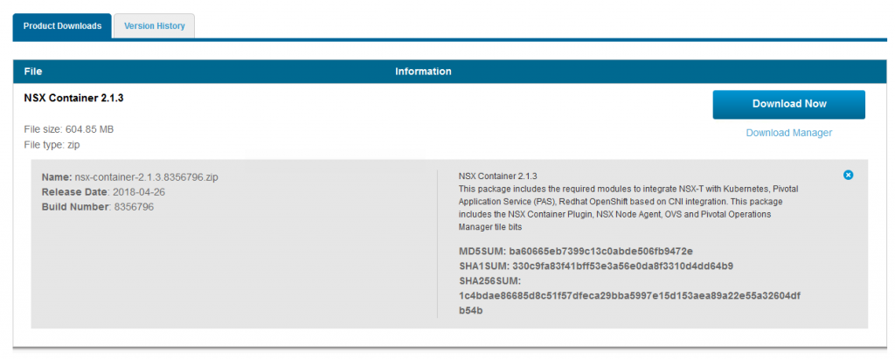
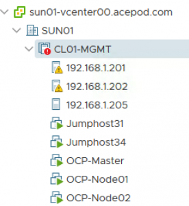
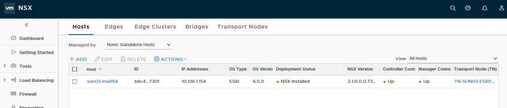
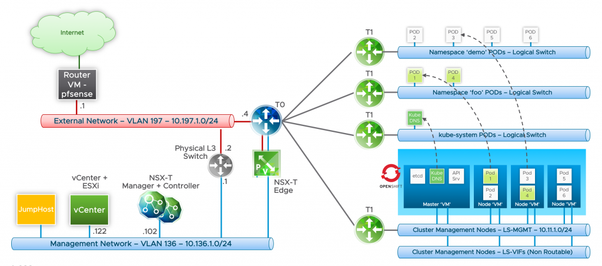

#Openshift with NSX-T Installation Part 1: Overview

The past few days I have been involved in an Openshift + NSX-T POC. In fact, 2 POCs because we setup one time at the customer lab and at the same I also repeat the same steps in my own lab so that I can learn as well. Before I proceed further, I would to shout out to Yasen, the NSBU TPM to guide me on the installation of the Openshift and integrating with NSX-T. Without his guidance and his help with the POC, this article would not be possible. As a promise, I would write a blog on the installation because I believe many in the community and my peers would need help in setting this up.

I’m going to break up the articles into various parts. *Inspirations from William Lam who did the PKS with NSX-T series.

# Table Of Contents
[Openshift with NSX-T Installation Part 1 Overview](https://github.com/vincenthanjs/openshift3.11-ncp2.4/blob/master/Part1-Overview/README.md)

[Openshift with NSX-T Installation Part 2: NSX-T](https://github.com/vincenthanjs/openshift3.11-ncp2.4)

[Openshift with NSX-T Installation Part 3: RHEL Preparation](https://github.com/vincenthanjs/openshift3.11-ncp2.4)

[Openshift with NSX-T Installation Part 4: Openshift Installation](https://github.com/vincenthanjs/openshift3.11-ncp2.4)

[Openshift with NSX-T Installation Part 5: NCP and CNI Integration (Combine into Part 4)](https://github.com/vincenthanjs/openshift3.11-ncp2.4)

[Openshift with NSX-T Installation Part 6: Demo App(Combine into Part 4)](https://github.com/vincenthanjs/openshift3.11-ncp2.4)

Components:

    Compute – vSphere 6.5+ (vCenter Server + ESXi) and Enterprise Plus license
    Storage – VSAN or other vSphere Datastores
    Networking & Security – NSX-T 2.1
    Openshift 3.9 Enterprise
    RHEL 7.5

Software Download:

Here is the complete list of software that needs to be downloaded to deploy Openshift and NSX-T.
Software 	Download URL
1) NSX-T 	 https://my.vmware.com/web/vmware/details?productId=673&downloadGroup=NSX-T-210
nsx-unified-appliance-2.1.0.0.0.7395503.ova
nsx-edge-2.1.0.0.0.7395502.ova
nsx-controller-2.1.0.0.0.7395493.ova
nsx-container-2.1.3.8356796.zip
2) RHEL 	https://access.redhat.com/downloads/
The version I used: rhel-server-7.5-x86_64-dvd.iso

Lab Environment:

For my Lab, I will be using two physical hosts. One host for the NSX-T management components and the other host to be the NSX-T Transport Node which will house the Openshift VMs which is one Master and two Node VMs. You can see there are 3 physical nodes in my cluster because I am using vSAN here as my shared storage. My lab is a non-nested setup but at the customer POC, we setup a nested environment using William Lam NSX-T Auto-Deploy Script and that works as well.

The good part of NSX-T is that you can select which hosts you would like to prepare as transport node instead of the whole cluster. You could also add in all the hosts in the whole cluster to be prepared as transport nodes with the use of the Compute Manager. In this case, I only selected 192.168.1.202 hosts as the transport node. The other two nodes are not prepared as transport nodes.

Compute/Storage
VM 	CPU 	MEM 	DISK
NSX-T Manager 	4 	16GB 	140GB
NSX-T Controller x 3 	4 	16GB 	120GB
NSX-Edge x 2 (Medium Size) 	4 	8GB 	120GB
Openshift Master 	4 	16GB 	40GB
Openshift Node01 	4 	16GB 	40GB
Openshift Node02 	4 	16GB 	40GB
			

Networking

Defined within your physical or virtual network infrastructure

    Management Network (10.136.1.0/24) – This is where the management VMs will reside such as the NSX-T Manager and Controllers.
    Transit Network (10.197.1.0/24) – This network is required to route between our management network via the NSX-T T0 Router and our Openshift Cluster Management network as well as the Openshift Workload networks. You only need two IPs, one for the gateway which should exists by default and one for the uplink which will reside on the T0. Static routes will be used to reach the NSX-T networks. In a Production or non-lab environment, BGP would be used to peer the T0 to your physical network
    Internet Network – IP address that is a able to access to Internet. For my lab, I setup a pfsense router as the next-hop for the T0 router and the pfsense router will basically NAT the networks in NSX-T such as the Openshift Cluster Management Network. I basically route 10.11.0.0/16, the whole subnet to NSX-T T0 which also means 10.11.*.* will have access to Internet. This will allow Internet access for the Openshift VMs for “yum install” and download relevant packages. ***Internet access is very important especially for the Openshift VMs, if not you will need to spend alot of time on troubleshooting.

Defined within NSX-T

    Openshift Cluster Management Network (10.11.1.0/24) – This network is used for the Openshift management POD which includes services like the Node Agent for monitoring liveness of the cluster and NSX-T Container Plugin (NCP) to name a few
    NAT IP Pool (10.11.2.0/24) – This network pool will provide addresses for when load-balancing services are required as part of an application deployment within Openshift. One IP address per project.
    NONAT IP Block (10.11.8.0/21) – This network is used when an application is requested to deploy onto a new Openshift namespace. A /24 network is taken from this IP Block and allocated to a specific Openshift project. This network will allow for 8 projects.
    Pod Networking IP Block (10.12.0.0/16) – This network pool will not be required to be routable in the external network.

Here is a logical diagram of my planned Openshift + NSX-T deployment:

