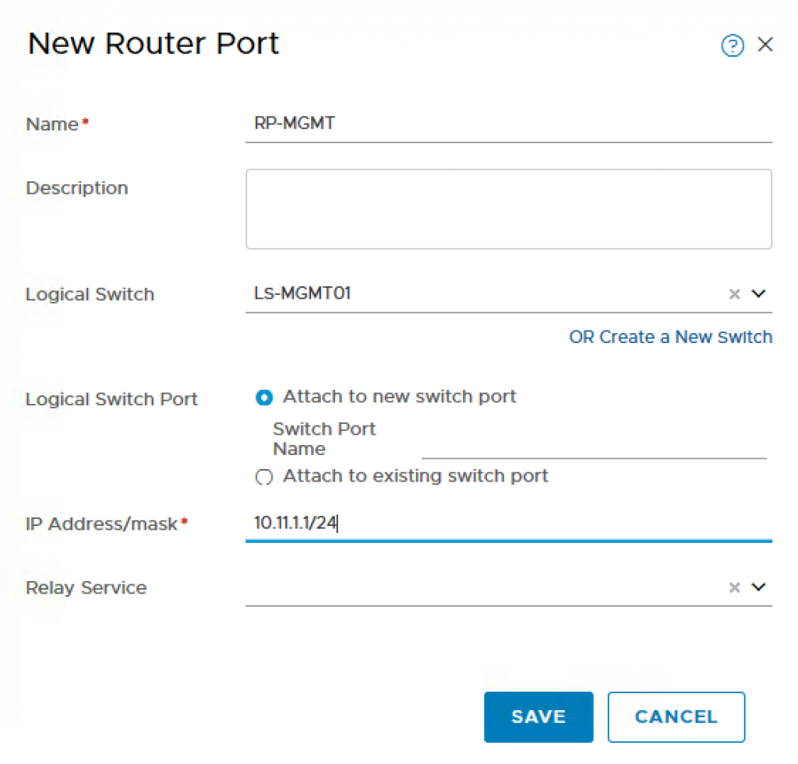

# Table Of Contents
[Openshift with NSX-T Installation Part 1 Overview](https://github.com/vincenthanjs/openshift3.11-ncp2.4/blob/master/Part1-Overview/)

[Openshift with NSX-T Installation Part 2: NSX-T](https://github.com/vincenthanjs/openshift3.11-ncp2.4/blob/master/Part2-NSX-T/)

[Openshift with NSX-T Installation Part 3: RHEL Preparation](https://github.com/vincenthanjs/openshift3.11-ncp2.4/tree/master/Part3-RHEL-Prepare/)

[Openshift with NSX-T Installation Part 4: Openshift Installation](https://github.com/vincenthanjs/openshift3.11-ncp2.4)

[Openshift with NSX-T Installation Part 5: NCP and CNI Integration (Combine into Part 4)](https://github.com/vincenthanjs/openshift3.11-ncp2.4)

[Openshift with NSX-T Installation Part 6: Demo App(Combine into Part 4)](https://github.com/vincenthanjs/openshift3.11-ncp2.4)

# Openshift with NSX-T Installation Part 2: NSX-T

In this article, we are now going to start configuring NSX-T so that it will be ready for us to install Openshift and consume the networking and security services provided by NSX-T. The result is that Openshift can deliver on demand provisioning of all NSX-T components: Container Network Interface (CNI), NSX-T Container Plugin (NCP) POD, NSX Node Agent POD, etc) automatically when a new Kubernetes (K8S) Cluster is requested, all done with a single CLI or API call. In addition, Openshift also provides a unique capability through its integration with NSX-T to enable network micro-segmentation at the K8S namespace level which allows Cloud/Platform Operators to manage access between application and/or tenant users at at a much finer grain level than was possible before which is really powerful!

I will not be walking through a step-by-step NSX-T installation and I will assume that you already have a basic NSX-T environment deployed which includes a few ESXi host prepped as Transport Nodes and at least 1 NSX-T Controller and 1 NSX-T Edge. If you would like a detailed step by step walk through, you can refer to the NSX-T documentation here or you can even leverage William Lam Automated NSX-T Lab Deployment script to setup the base environment and modify based on the steps in this article.

For my lab, I actually setup the NSX-T manually using my previous NSX-T 2.1 Install Documentation. You can follow the guide until the NSX Edges deployment because in NSX-T 2.1, you can actually use the NSX Manager to deploy the Edges.

Step 1 – Verify that you have prepped the ESXi hosts which will be used to deploy the Openshift workload VMs. In my example below, I only have one host is that prepare for NSX-T Transport Nodes. This would also means the Openshift VMs need to be pin to this hosts. You can use Affinity Rules to do that.

Step 2 – Create a new IP Pool which will be used to allocate Virtual IPs for the exposed Openshift Services (e.g Load Balancer for application deployments). To do so, navigate to Inventory->Groups->IP Pool and provide the following:

    Name: Pool-NAT
    IP Range: 10.11.2.1 – 10.11.2.254
    CIDR: 10.11.2.0/24

Step 3 – Create a new IP Block which will by used by Openshift on-demand to carve up into smaller /24 networks and assigned those to each K8S namespace. This IP block should be sized sufficiently to ensure you do not run out of addresses and currently it is recommended to use a /16 network (non-routable). I’m using a /21 network. To do so, navigate to DDI->IPAM and provide the following:

    Name: IPBlock-NONAT
    CIDR: 10.11.8.0/21

Step 4 – Create a new T0 Router which will be used to communicate with your external physical network. Make sure you have either created an Edge Cluster (can contain a single Edge) or create a new Edge Cluster if you have not already. The HA mode must be Active/Standby as NAT is used by the NCP service within K8S Management POD. To do so, navigate to Routing->Routers and provide the following:

    Name: T0
    Edge Cluster: EdgeCluster01
    High Availability Mode: Active-Standby
    Preferred Member: TN-SUN03-EDGEVM01

Step 5 – Create a static route on the T0 which will enable all traffic from the Openshift Management PODs to be able to communicate outbound to our Management components.  In my example, 10.197.1.0/24 is the intermediate network’s gateway which will be used to route traffic from within T0 to my virtual router (pfSense). To do so, click on the T0 Router you just created and navigate to Routing->Static Routes and provide the following:

    Network: 0.0.0.0/0
    Next Hop: 10.197.1.1

 

For my lab, I have a few other internal networks that I would like to route into the NSX-T networks. There I added another static route.

    Network: 192.168.0.0/16
    Next Hop: 10.197.1.2

Step 6 – Next, we need to create three Logical Switches, one that will be used for the T0 uplink, the other for Openshift Management Cluster which is used to run the Openshift Management POD and the last for internal network of the NCP communication. To do so, navigate to Switching->Switches and add the following:

    Name: LS-EdgeUplink01
    Transport Zone: TZ-VLAN
    VLAN: 0

    Name: LS-MGMT01
    Transport Zone: TZ-Overlay
    VLAN: NIL

    Name: LS-VIFs
    Transport Zone: TZ-Overlay
    VLAN: NIL

After this step, you should have three Logical Switches as shown in the screenshot below. TheLS-EdgeUplink01 should be on TZ-VLAN and the LS-MGMT01 and LS-VIDs should be on TZ-Overlay.

Step 7 – Now we need to configure the Uplink Router Port and assign it an address from the intermediate network so that we can route from the T0 to our physical or virtual router. To do so, navigate to Routing and then click on the T0 Router we had created earlier and select Configuration->Router Ports and provide the following:

    Name: RP-Uplink01
    Type: Uplink
    Transport Node: TN-SUN03-EDGEVM01
    Logical Switch: LS-EdgeUplink01
    Logical Switch Port: Uplink-1-Port
    IP Address/mask: 10.197.1.5/24

    Name: RP-Uplink02
    Type: Uplink
    Transport Node: TN-SUN03-EDGEVM02
    Logical Switch: LS-EdgeUplink02
    Logical Switch Port: Uplink-2-Port
    IP Address/mask: 10.197.1.6/24

Step 8 – Because I have two Edges, you will need to create HA VIP.

    VIP Address: 10.197.1.4/24
    Status: Enable
    Uplink Ports: RP-Uplink1, RP-Uplink2

Step 9 – Create a new T1 Router which will be used for the K8S Management Cluster POD. To do so, navigate to Routing->Routers and provide the following:

    Name: T1-Mgmt
    Tier-0 Router: T0
    Failover Mode: Preemptive
    Edge Cluster: <No need to select>

Step 10 – Configure the Downlink Router Port for the Openshift Management Cluster which is where you will define the network that NSX-T will use for these VMs. In my example, I use 10.11.1.0/24.To do so, click on the T1 Router that you had just created and navigate to Configuration->Router Ports and provide the following:

    Name: RP-MGMT
    Logical Switch: LS-MGMT01
    Logical Switch Port: Attach New Switch Port
    IP Address/mask: 10.11.1.1/24

Step 11 – To ensure the Openshift network will be accessible from the outside, we need to advertise these routes. To do so, click on the T1 Router you had created earlier and navigate to Routing->Route Advertisement and enable the following:

    Status: Enabled
    Advertise All NSX Connected Routes: Yes

Step 12 – This step maybe optional depending how you have configured your physical networking, in which case you will need to use BGP instead of static routes to connect your physical/virtual network to NSX-T’s T0 Router. In my environment, I am using a virtual router (pfSense) and easiest way to enable connectivity from both my management network as well as networks that my vCenter Server, ESXi hosts, NSX-T VMs and Management VMs are hosted on to communicate with Openshift is setting up a few static routes. We need to create one static routes to reach both our Openshift Management Cluster Network (10.11.1.0/24) as well as Openshift Projects Network (10.11.8.0/21). I can summarise into 10.11.0.0/16 one route. For all traffic destine to either of these networks, we will want them to be forwarded to our T0’s HA uplink address which if you recall from Step 7 is 10.197.1.4. Depending on the physical or virtual router solution, you will need to follow your product documentation to setup either BGP or static routes.

Step 13 – At this point, we have completed all the NSX-T configurations and we can run through a few validation checks to ensure that when we go and deploy the Openshift Management VMS (One Master and Two Nodes), we will not run into networking issues. This is a very critical step and if you are not successful here, you should go back and troubleshoot prior to moving on.

To verify Overlay network connectivity between ESXi hosts and Edge VM, you should be able to ping using the VXLAN netstack between all ESXi hosts as well as to the Edge VM’s overlay interface. Below is a table of the IPs that were automatically allocated from the VTEP’s IP Pool, you can discover these by logging onto the ESXi host but they should be sequential from the stating range of your defined IP Pool. Also make sure you have your physical and virtual switches configured to use MTU 1600 for overlay traffic.
Host 	IP Address
esxi 	 10.140.1.11
edge01 	 10.140.1.12
edge02 	 10.140.1.13
	

You can SSH to each ESXi host and run the following:
<pre><code>
vmkping ++netstack=vxlan [IP]
</code></pre>

or you can also do this remotely via ESXCLI by running the following:
<pre><code>
esxcli network diag ping –netstack=vxlan –host=[IP]
</code></pre>
OR you can also SSH to the Edge. Do a vrf 0 and ping the overlay networks.

To verify connectivity to NSX-T Networks as well as routing between physical/virtual networking to NSX-T, use your Jumphost and you should be able to ping the following addresses from that system:

    10.11.1.1 (Downlink Router Port to our Openshift Management Cluster network)
    10.197.1.4 (Uplink Router Port)

In the next blog post, we will start our Openshift deployment starting with RHEL preparation.