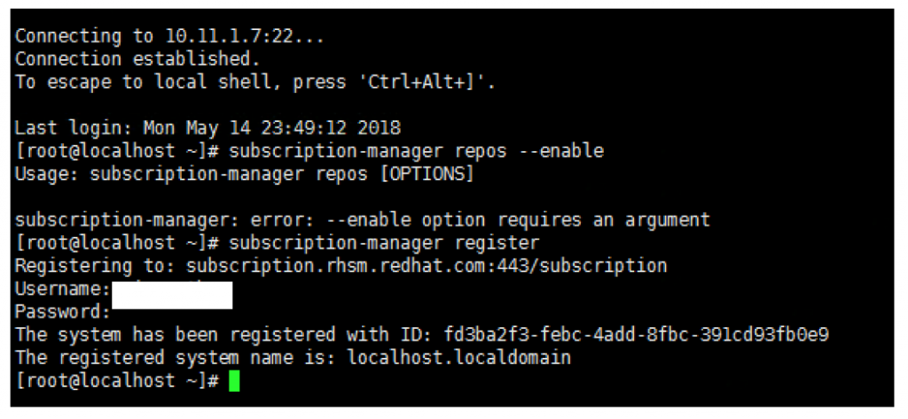
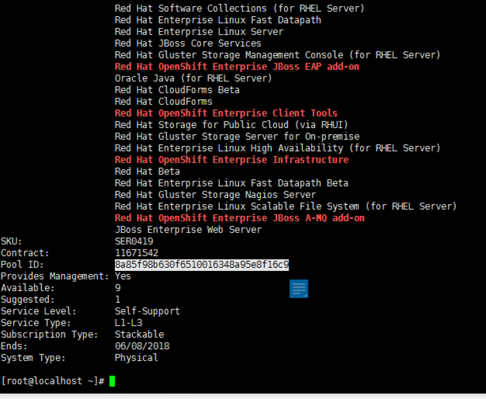

# Openshift with NSX-T Installation Part 3: RHEL

Update on 11 March 2019
The steps below will work for Openshift 3.11 as well.

In this article we start install RHEL and install Openshift.

The main guide for the installation I reference from is at https://access.redhat.com/documentation/en-us/openshift_container_platform/3.9/html-single/installation_and_configuration/. Chapter 2.6 Advanced Installation.

Step 1: Create a VM and install RHEL from iso. I place this VM on the LS-MGMT01 logical switch and this has internet access. Therefore, when you clone the VM, they will be on the same network.

As the installation complete, create the root password.

Step 2: Start the VM, so we can install all the dependencies.

Configure the IP. I use nmtui.

Ping the gateway and ping 8.8.8.8 to test whether you have access to Internet.

 

Step 3: Follow the installation guide to install all the pre-req. Run the following commands.

<pre><code>
subscription-manager register –username=<Redhat Openshift Username>
</code></pre>

subscription-manager refresh
subscription-manager list –available –matches ‘*OpenShift*’

subscription-manager attach –pool=<highlighted>

subscription-manager repos –disable=”*”
yum repolist

For Openshift Enterprise 3.11

    subscription-manager repos –enable=”rhel-7-server-rpms” –enable=”rhel-7-server-extras-rpms”  –enable=”rhel-7-server-ose-3.11-rpms” –enable=”rhel-7-server-ansible-2.6-rpms”

For Openshift Enterprise 3.9

    subscription-manager repos –enable=”rhel-7-server-rpms” –enable=”rhel-7-server-extras-rpms” –enable=”rhel-7-server-ose-3.9-rpms” –enable=”rhel-7-fast-datapath-rpms” –enable=”rhel-7-server-ansible-2.4-rpms”

yum install wget git net-tools bind-utils iptables-services bridge-utils bash-completion kexec-tools sos psacct nano httpd-tools  atomic-openshift-utils unzip

yum update

systemctl reboot

Step 3: Now we going to upload the NSX Container zip file to the master copy.

** For Openshift 3.11, I used NCP 2.3.2. The filename is nsx-container-2.3.2.11695762.zip.

The version I used is 2.13. Filename: nsx-container-2.1.3.8356796.zip.
Place this file in /root.

 

[root@ocp-master ~]# unzip nsx-container-2.1.3.8356796.zip

Step 4: Now we are reading to clone this VM to 3 copies.
I name my VMs the following

    OCP-Master (IP: 10.11.1.10/24)
    OCP-Node01 (IP: 10.11.1.11/24)
    OCP-Node02  (IP: 10.11.1.12/24)

 

Console to each VM. Change the IP using nmtui command. You can either use nmtui to deactivate/activate the connection or use ifdown ens192 and ifup ens192.

 

Once you configure ocp-node02, you can try to ping to the rest of the nodes.

Next we going to put in host entries in each of the nodes so that we can reach each nodes using hostnames.
nano /etc/hosts on each node.

On OCP-Master

On OCP-Node01

On OCP-Node02

Once done, you can test connectivity from the master to the rest of the nodes. Repeat the process from Node01 and Node02.

Step 4: Resume back to the preparation of the hosts.

ssh-keygen

# for host in ocp-master01 \
    ocp-node01 \
    ocp-node02; \
    do ssh-copy-id -i ~/.ssh/id_rsa.pub $host; \
    done

Once this is done, you can try SSH from the master to node01 and node02 without any login.

 