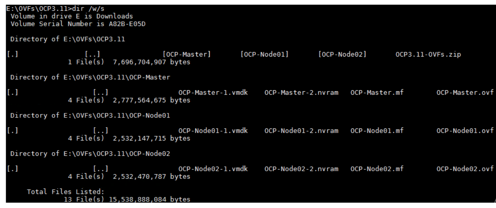

# How to install Openshift Container Platform OCP with NSX-T NCP
[Home Page](https://github.com/vincenthanjs/openshift3.11-ncp2.4)

The last few blog posts I wrote about the installation steps for Openshift Container Platform (OCP) with NSX-T NCP attracted some good interest from the community as well as VMware internal folks. However, those materials were written quite awhile back and some of software used then were not up to date. My customers were also looking at the later versions of software. Lastly, in OCP 3.11, the ansible playbooks for NSX-T NCP integration comes out of the box and therefore makes the integration much simpler. Therefore, gave the reason to write this blog post.

The high level steps remains unchanged. However, the part 5 in this case has been streamline into the Openshift installation.

# Table Of Contents
*[Openshift with NSX-T Installation Part 1 Overview] ()
*[Openshift with NSX-T Installation Part 2: NSX-T] ()
*[Openshift with NSX-T Installation Part 3: RHEL Preparation] ()
*[Openshift with NSX-T Installation Part 4: Openshift Installation] ()
*[Openshift with NSX-T Installation Part 5: NCP and CNI Integration (Combine into Part 4)] ()
*[Openshift with NSX-T Installation Part 6: Demo App] ()

** For fellow VMware colleagues, to save you time for preparing the RHEL templates and VMs for OCP install, I have exported out the VMs from my Lab. I have uploaded in onedrive. Email me, I will happily share the link to download. Size is about 7GB.

