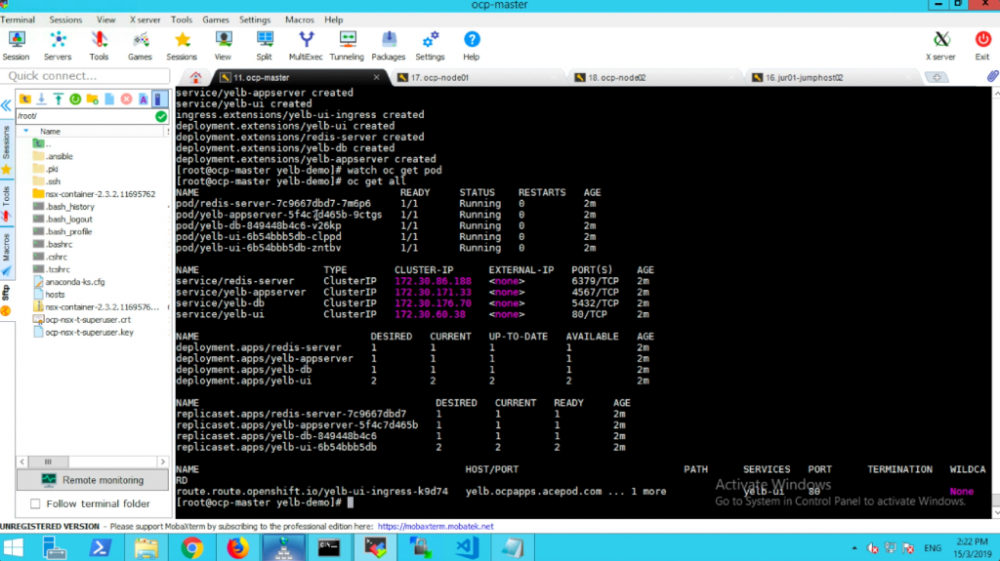

# How to install Openshift Container Platform OCP 3.11 with NSX-T NCP 2.3/2.4
[Home Page](https://github.com/vincenthanjs/openshift3.11-ncp2.4)

The last few blog posts I wrote about the installation steps for Openshift Container Platform (OCP) with NSX-T NCP attracted some good interest from the community as well as VMware internal folks. However, those materials were written quite awhile back and some of software used then were not up to date. My customers were also looking at the later versions of software. Lastly, in OCP 3.11, the ansible playbooks for NSX-T NCP integration comes out of the box and therefore makes the integration much simpler. Therefore, gave the reason to write this blog post.

The high level steps remains unchanged. However, the part 5 in this case has been streamline into the Openshift installation.

# Table Of Contents
[Openshift with NSX-T Installation Part 1 Overview](https://github.com/vincenthanjs/openshift3.11-ncp2.4/blob/master/Part1-Overview/)

[Openshift with NSX-T Installation Part 2: NSX-T](https://github.com/vincenthanjs/openshift3.11-ncp2.4/blob/master/Part2-NSX-T/)

[Openshift with NSX-T Installation Part 3: RHEL Preparation](https://github.com/vincenthanjs/openshift3.11-ncp2.4/tree/master/Part3-RHEL-Prepare/)

[Openshift with NSX-T Installation Part 4: Openshift Installation](https://github.com/vincenthanjs/openshift3.11-ncp2.4)

[Openshift with NSX-T Installation Part 5: NCP and CNI Integration (Combine into Part 4)](https://github.com/vincenthanjs/openshift3.11-ncp2.4)

[Openshift with NSX-T Installation Part 6: Demo App(Combine into Part 4)](https://github.com/vincenthanjs/openshift3.11-ncp2.4)

** For fellow VMware colleagues, to save you time for preparing the RHEL templates and VMs for OCP install, I have exported out the VMs from my Lab. I have uploaded in onedrive. Email me, I will happily share the link to download. Size is about 7GB.

Components:

    Compute – vSphere 6.7+ (vCenter Server + ESXi) and Enterprise Plus license
    Storage – VSAN or other vSphere Datastores
    Networking & Security – NSX-T 2.3 (Works for NSX-T 2.4.x as well)
    Openshift Container Platform 3.11 Enterprise
    RHEL 7.6

Software Download:

Here is the complete list of software that needs to be downloaded to deploy Openshift Container Platform and NSX-T.
Software 	Download URL
1) NSX-T 	nsx-unified-appliance-2.3.0.0.0.10085405.ova (From 2.2 onwards, you can deploy NSX-T Controllers and Edges from the NSX-T Manager)
https://my.vmware.com/web/vmware/details?productId=673&downloadGroup=NSX-T-230

(Works for NSX-T 2.4.x as well)
https://my.vmware.com/web/vmware/details?productId=673&downloadGroup=NSX-T-240 

2) nsx-container-2.3.2.11695762.zip https://my.vmware.com/web/vmware/details?productId=673&downloadGroup=NSX-T-230#drivers_tools

(Works for NCP 2.4.x as well)
https://my.vmware.com/web/vmware/details?productId=673&downloadGroup=NSX-T-240#drivers_tools

3) RHEL 	https://access.redhat.com/downloads/
The version I used: rhel-server-7.6-x86_64-dvd.iso

# Openshift Installation & NSX-T NCP Integration

1) On every node, install docker.
<pre><code>
        yum install docker-1.13.1
</code></pre>

2) On the master node or jumphost, run the pre-requisites playbook.

<pre><code>
        ansible-playbook /usr/share/ansible/openshift-ansible/playbooks/prerequisites.yml
</code></pre>

3) On every node,
<pre><code>
        docker load -i /root/nsx-container-2.3.2.11695762/Kubernetes/nsx-ncp-rhel-2.3.2.11695762.tar
        docker image tag registry.local/2.3.2.11695762/nsx-ncp-rhel nsx-ncp
</code></pre>

 4) On the master node or jumphost, run the deploy-cluster playbook.
<pre><code>
        ansible-playbook /usr/share/ansible/openshift-ansible/playbooks/deploy_cluster.yml
</code></pre>
 

5) Success!!!

# Validation

You can see the NCP and Node Agents being deployed as Pods under the nsx-system namespace.

    oc get pod –all-namespaces

If the NCP integration is successful, you should not see any error logs

    oc logs nsx-ncp-279qf -n nsx-system | grep error

You can also do that for the node agent. However, there are 2 containers in the node-agent pod, you will need to specify the container using -c.

    oc logs nsx-node-agent-56f2s -c node-agent -n nsx-system | grep error

On the NSX-T side, if the integration is successful, you will see a bunch of default logical switches, logical routers as well as load balancer being created.

You can also access the Openshift Container Platform web console using the https://ocp-master:8443. (You might need to add a host DNS entry)

# Demo Test App
Alright. Now lets test whether is the Container Network Interface(CNI) and NCP are working correctly by deploying a demo test application. I normally use the Yelb app for my demo and testing.

1) On the master node,

        oc new-project yelb
        git clone https://github.com/vincenthanjs/yelb-demo.git

     
2) You will need to add policy before you can deploy the Pods. If not you will error in deploying the containers.

        oc adm policy add-scc-to-user anyuid -z default
        oc adm policy add-scc-to-user anyuid -z router
        oc adm policy add-scc-to-user anyuid -z builder
        oc adm policy add-scc-to-user anyuid -z deployer

    
3) Now, you can deploy the yelb app.

        oc create -f yelb-app.yaml

    
4) Watch the containers creating.

        watch oc get pod

    
5) NSX-T Load Balancer supports Ingress service type.

        oc get all

    
6) Previously I already had a wildcard domain already pointed to the Openshift Load Balancer virtual IP.

You can watch the full Openshift Container Platform installation and integration with NSX-T NCP over here.

